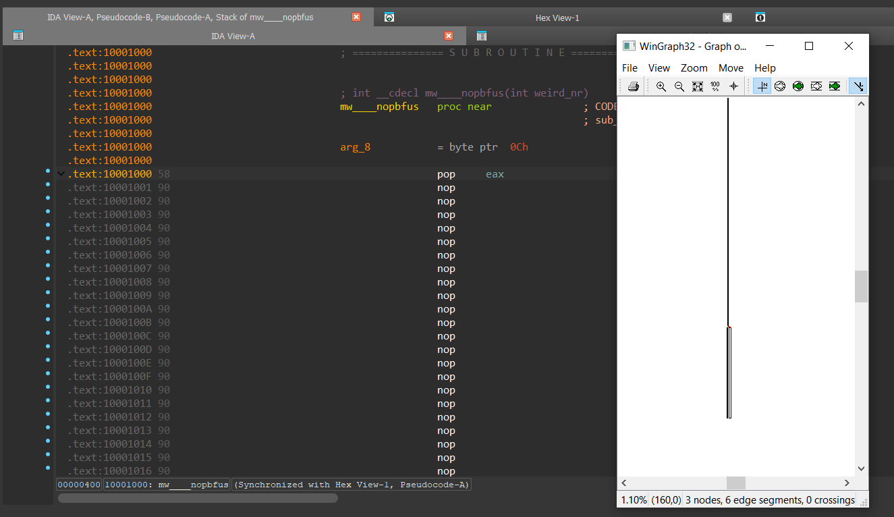
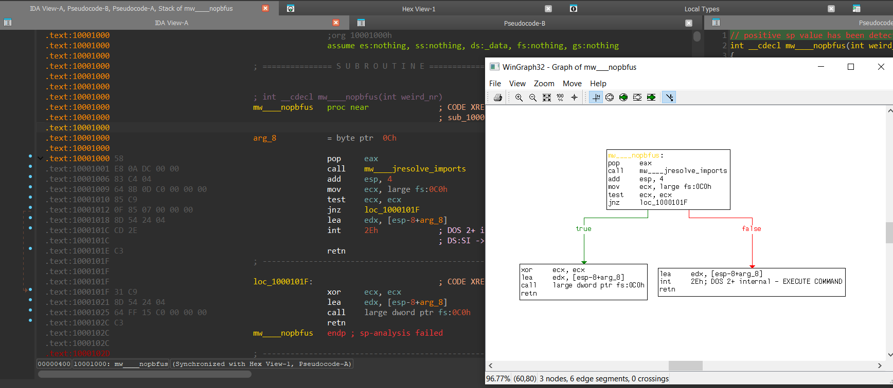

# deNOPfuscator (PoC)

IDAPython script for IDA 9 that removes superfluous NOPs as seen in samples packed by Dave crypter.

It fixes up relative addresses, patches the database and adjusts the function size.

Testfile: d982401b64ae312363fafadcfdedabdd7c13ad89651767c5c6bc0fef03f63fb4

### Before:

### After:

